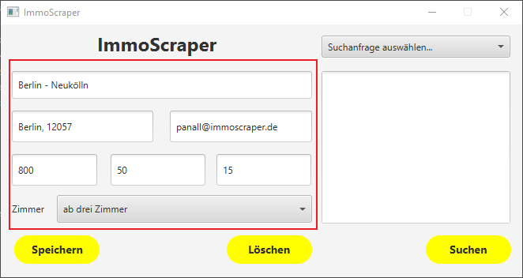

# ImmoScraper
---

## Installation
---

Für die Installation muss das Projekt heruntergeladen werden.\
Um den ImmoScraper zu verwenden, wird ein Rechner mit **Java** (min. Java **Version 11**) benötigt.\
Um das Programm auszuführen muss die ausführbare **.jar-Datei** gestartet werden.\
Nun sollte eine Anwendung erscheinen und das Programm ist bereit!

## Handbuch
---
Wenn die ausführbare .jar-Datei gestartet wurde, sollte so ein Fenster erscheinen:

Hier hat man die Möglichkeit mit **Los!** eine neue Suchanfrage zu einer Wohnung/Immobilie zu stellen oder eine bereits erstellte Suchanfrage zu bearbeiten.

#### Suchanfrage erstellen
Beim Klick auf **Los!** erscheint eine neue Maske:

Damit ImmoScraper etwas finden kann, werden hier ein paar **Informationen** zur gesuchten Wohnung/Immobilie benötigt.

Beispiel:

#### Suchanfrage speichern
Ein Klick auf **Speichern** speichert die derzeit eingegebenen Informationen als Suchanfrage unter dem angegebenen Namen.

Um eine Suchanfrage zu **bearbeiten** geht man zunächst zurück zum Start:

Hier wählt man die jeweilige Suchanfrage, die bearbeitet werden soll, aus der Drop-Down-Liste aus und klickt auf **Los!**:

Nun hat man die Möglichkeit seine Suchanfrage zu bearbeiten, sollte sich etwas geändert oder sollte man sich vertippt haben.

Ein Klick auf **Löschen** entfernt die jeweilige Suchanfrage wieder.

Mit einem Klick auf **Suchen** werden die Informationen aus den Feldern der Suchanfrage vom Controller aus an die ImmoScout API geschickt.\
Die Scraping-Einheit von ImmoScraper sucht sich die nächsten Wohnungen/Immobilien mit den Kriterien heraus und gibt die Informationen zurück.
Der Controller sendet diesbezüglich dann eine E-Mail mit den Informationen an die angegebene E-Mail-Adresse.

JavaFx skd runterladen: 
https://gluonhq.com/products/javafx/

Dann neue Run Configuration anlegen: 
--> Application 
--> modulpath angeben
--> VM Options: 

--module-path /home/henne/apps/javafx-sdk-11.0.2/lib --add-modules javafx.controls,javafx.fxml

sollte dann laufen. 

Scene Builder könnte beim Frontend bauen hilfreich sein. 
