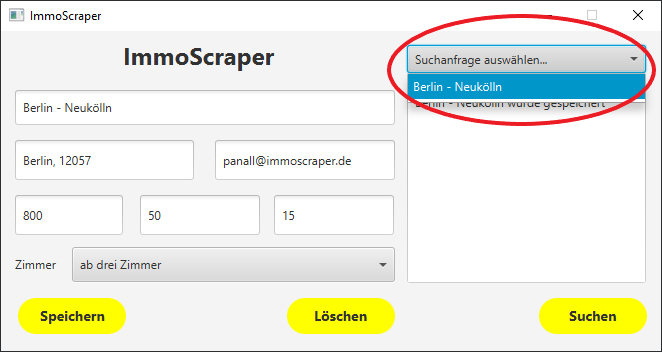
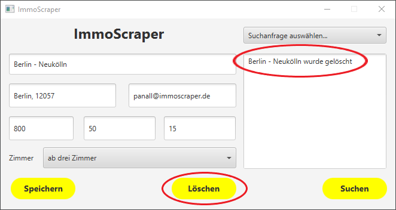

# ImmoScraper
ImmoScraper ist im Rahmen eines Schulprojekts entstanden.

Bei ImmoScraper handelt es sich um eine Java-Anwendung, die nach bestimmten Suchkriterien Wohnungen/Immobilien auf ImmoScout24 (https://www.immobilienscout24.de) heraussucht und dem Nutzer Informationen über Wohnungen/Immobilien per E-Mail zukommen lässt.

## Inhaltsverzeichnis

- [Installation](#installation)
- [Handbuch](#handbuch)
    - [Suchanfrage erstellen](#suchanfrage-erstellen)
    - [Suchanfrage speichern](#suchanfrage-speichern)
    - [Suchanfrage bearbeiten](#suchanfrage-bearbeiten)
    - [Suchanfrage löschen](#suchanfrage-löschen)
    - [Benachrichtigt werden](#benachrichtigt-werden)
- [Schnittstellen](#schnittstellen) 
- [Daten](#daten)
- [Entwicklung](#entwicklung)
    - [UI](#ui)
    - [API](#api)
    - [Speichern von Suchanfragen](#speichern-von-suchanfragen)

## Installation

Für die Installation muss das Projekt heruntergeladen werden.\
Um den ImmoScraper zu verwenden, wird ein Rechner mit **Java** (min. Java **Version 11**) und zum packaging einer ausführbaren jar Datein wir **Maven** (**Version 3.6.x**) benötigt.\
Zur Erstellung einer ausführbaren jar datei ins modul "app" navigieren und auf der konsole   "mvn package" ausführen. \
Die App wird dann im Ordner target generiert. 
Um das Programm auszuführen muss die ausführbare **immoscraper_app-1.0-SNAPSHOT.jar** gestartet werden.\
Nun sollte eine Anwendung erscheinen und das Programm ist bereit!

## Handbuch

Wenn die ausführbare **immoscraper.jar**-Datei gestartet wurde, sollte so ein Fenster erscheinen:

Hier hat man die Möglichkeit eine neue **Suchanfrage** zu einer Wohnung/Immobilie zu erstellen oder eine bereits erstellte Suchanfrage zu bearbeiten.
Die jeweiligen Informationen zu einer Wohnung/Immobilie müssen hier in den Feldern angegeben werden. Dabei ist zu beachten, dass die Angabe des **Namens der Suchanfrage**, die **E-Mail-Adresse**, und die Informationen **Ort, Postleitzahl oder Stadt** **erforderlich** sind. Der Rest ist optional.  

#### Suchanfrage erstellen

Damit ImmoScraper nach einer gewünschten Wohnung/Immobilie suchen kann, werden hier ein paar **Informationen** zur Wunsch-Wohnung/-Immobilie benötigt.

Beispiel:\

#### Suchanfrage speichern
Ein Klick auf **Speichern** speichert die derzeit eingegebenen Informationen als Suchanfrage unter dem angegebenen Namen.
\
(Suchanfragen werden in einer CSV-Datei abgespeichert und niedergeschrieben.)

#### Suchanfrage bearbeiten
Damit eine Suchanfrage bearbeitet werden kann, muss man diese zunächst in der Drop-Down-Liste des Programms auswählen.
\

Nun hat man die Möglichkeit die ausgewählte Suchanfrage zu bearbeiten, sollte sich etwas geändert oder sich vertippt haben.

#### Suchanfrage löschen
Ein Klick auf **Löschen** entfernt die ausgewählte Suchanfrage und die Informationen aus der CSV Datei wieder.

#### Scraping stoppen
Um dem Programm zu befehlen das Scraping zu stoppen
Damit das Programm das Scraping stoppt, muss der **Stop** Button getätigt werden. Dieser befiehlt der Scraping-Einheit das Scrapen einzustellen.

#### Benachrichtigt werden
Mit einem Klick auf **Suchen** werden die Informationen aus den Feldern der Suchanfrage als Query-String in den immoscout24-Link eingefügt.\
*(z.B. www.immobilienscout24.de/Suche/de/ + searchQuery + /wohnung-mieten?enteredFrom=one_step_search" )*

Die Scraping-Einheit von ImmoScraper sucht sich die nächsten Wohnungen/Immobilien mit den jeweiligen Kriterien heraus und gibt die Informationen zurück.
Der Controller sendet diesbezüglich dann eine E-Mail mit den Informationen an die angegebene E-Mail-Adresse.

## Schnittstellen

ImmoScraper selbst spricht keine externen Schnittstellen an.\
Aber damit ImmoScraper Informationen zu Wohnungen/Immobilien nach bestimmten Suchkriterien finden kann, muss eine Suchanfrage angelegt werden.\
Damit eine Suchanfrage gespeichert wird und wiederverwendbar/bearbeitbar ist, wird die interne Schnittstelle **Repository** angesprochen. Durch das Ansprechen der Schnittstelle werden Funktionen im **Backend** aufgerufen, die die Informationen der Queries in einer **CSV-Datei** persistent abspeichern.

## Daten
Die Informationen einer Suchanfrage werden innerhalb einer **CSV-Datei** gespeichert. Die Daten weisen eine **sehr geringe Komplexität** auf und sind durch die Verwendung in einer CSV-Datei für das Programm **sehr schnell zu verarbeiten**.

## Entwicklung

### UI
Im Laufe der Entwicklung des Projekts hat sich das Team entschieden eine **modernere, jedoch simplere** Benutzeroberfläche zu entwickeln, als eigentlich geplant war.
Die neue Oberfläche erscheint **übersichtlicher und einfacher** zu verwenden, als die Konzeptvorlage.
Der **Vorteil** der neuen Oberfläche ist, dass sich alles auf einer Szene abspielt und diese nicht gewechselt werden muss.
Da es sich beim ImmoScraper um ein *einfaches* Programm handelt, passt die neue UI sehr gut.

### API
Ursprünglich war es geplant über den ImmoScraper eine Verbindung zur offiziellen API von ImmoScout24 (https://api.immobilienscout24.de/) herzustellen und daraus Informationen zu beziehen.
Letztendlich war es einfacher die Informationen eines Querys in einen Link einzubauen und die Informationen mittels der Scraping-Einheit herauszulesen.

### Speichern von Suchanfragen
Die Suchanfragen sollten eigentlich als JSON-String abgespeichert werden.\
Aufgrund der Funktionalität des Programms und der **sehr geringen Komplexität der Datensätze** werden die Querys in einer **CSV-Datei** abgespeichert.